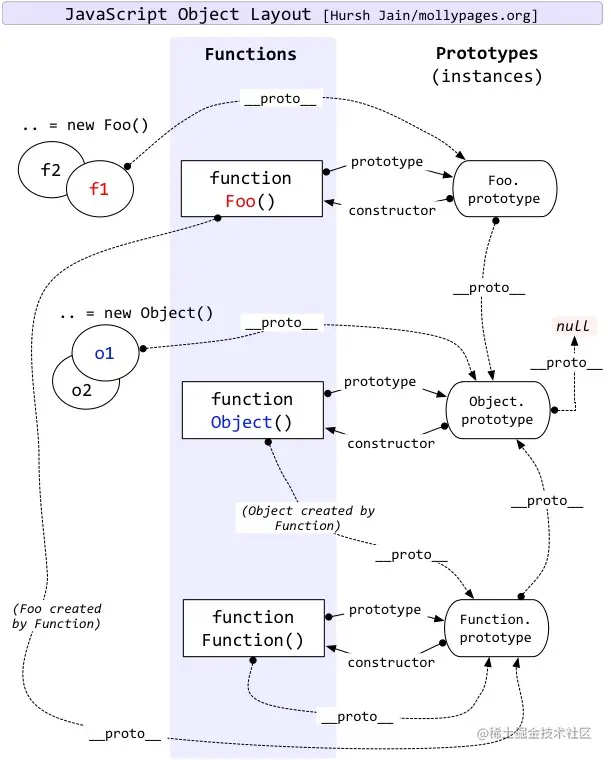

### JS原型链

#### 关系图


#### 核心规则

- 函数对象才有prototype，__proto__是所有对象都有的属性
- __proto__对象，有两个属性，*constructor*和 *\_\_proto\_\_*
- prototype只有一个属性 *constructor*

```javascript

function Person(country) {
  this.country = country;
}

Person.prototype.getCountry = function() {
  return this.country;
}

let hanMeiMei = new Person("United States");

console.assert(hanMeiMei instanceof Person);
console.assert(hanMeiMei.__proto__ === Person.prototype);
console.assert(hanMeiMei.__proto__.__proto__ === Object.prototype);
console.assert(Person.prototype.__proto__ === Object.prototype);
console.assert(Function.__proto__ === Function.prototype);
console.assert(Object.prototype.__proto__ === null);
```

#### 几个特殊情况
- Function.__proto__ === Function.prototype *这个就离谱，鸡生蛋还是蛋生鸡？？*
- Object.prototype.__proto__ === null
- Function.prototype.bind 方法没有prototype


#### 小扩展

*这里有个小场景，叫做原型污染*

##### 例子, 比如将接口返回改造成这样
```javascript
{__proto__: {admin: 1}}
```
那么当代码将这个json存下来，使用这个对象时，就会出现误用，造成系统出问题
处理方式有几种：

1. 处理外来JSON时先用Object.create(null)，将原型链限死 （可以参见**对象的创建**）
2. 通过Object.freeze冻结属性，使之不可扩展
3. 合并对象时，过滤掉 __proto__, prototype这些key